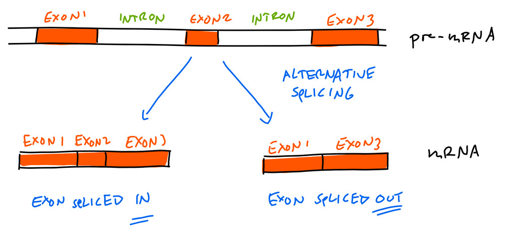
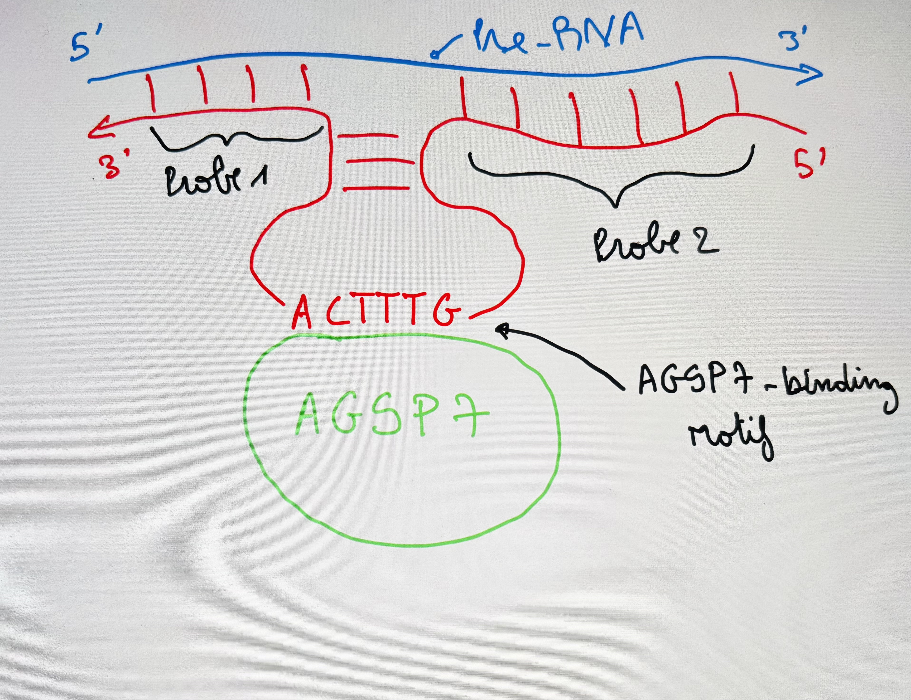

# RNA Splicing Analysis 🧬

## Research Question

How do sequence motifs and exon structure influence alternative RNA splicing events?

Specifically, this project investigates:

- the occurrence of optional exons
- the influence of the AGSP7 binding motif
- correlations between exon features and splicing ratios

---
## Overview

This project analyzes **RNA splicing and alternative splicing events** using RNA-Seq data.  
The goal is to investigate splicing patterns, identify optional exons, and explore correlations between sequence motifs and splicing behavior.

The analysis pipeline includes:

- Adapter removal
- Detection of Splicing RNA
- Detection of optional exons
- Motif analysis (AGSP7 binding motif)
- Correlation analysis between features
- Reference ratio analysis

All analyses were performed using **Python notebooks** and **Bash**.

---

## Biological Background

RNA splicing is a fundamental process in gene expression where **introns are removed and exons are joined** to produce mature mRNA.

**Alternative splicing** allows a single gene to produce multiple protein isoforms by including or excluding specific exons.



Understanding these mechanisms is important for:

- gene regulation
- protein diversity
- disease research

---

## Project Workflow

The analysis consists of several steps:

---


### 1. Adapter Removal
Sequencing adapters are removed from raw reads to ensure clean downstream analysis.

Notebook: **adapter_removal.ipynb**


---


### 2. Splicing RNA Detection

This step identifies **splRNAs(Splicing RNA)** that ensure and regulate the splicing alternative


---

### 3. Optional Exon Detection

This step identifies **optional exons** that may or may not appear in the final transcript.

Notebook: **optional_exons_analysis.ipynb**


---

### 4. Motif Analysis

Analysis of the **AGSP7 binding motif** to determine whether specific sequence motifs influence splicing behavior.

Notebook: **agsp7_binding_motif.ipynb**


---

### 5. Correlation Analysis

Statistical analysis of correlations between different splicing-related variables.

Notebook: **correlation_analysis.ipynb**


---

### 6. Reference Ratio Analysis

Comparison between observed splicing ratios and reference expectations.

Notebook: **reference_ratio.ipynb**


---

## Technologies Used

- Python3
- Jupyter Notebook
- Pandas
- NumPy
- Matplotlib / Seaborn

Concepts:

- RNA-Seq analysis
- Alternative splicing
- motif analysis
- statistical correlation
- biological data processing

---

## Requirements

- python3
- pandas
- numpy
- matplotlib
- seaborn
- jupyter
- scipy
---

## Results

The analysis revealed several patterns:

- Certain exons appear as optional depending on sequence context.
- The AGSP7 binding motif shows enrichment near specific splice sites.
- Correlation analysis suggests relationships between motif presence and exon inclusion rates.

These results illustrate how sequence features may influence alternative splicing.

---

## Project Report

A detailed description of the project and the interpretation are available in:

`project_description.pdf`

---
## Future Work

Possible extensions of this project include:

- integrating additional splicing factors
- applying machine learning to predict exon inclusion
- comparing splicing patterns across species

---
## Author

Bioinformatics student (3rd semester)

Interested in:

- computational biology
- RNA-Seq analysis
- biological data science
- scientific programming

---
## Repository Structure
```
RNA-Splicing-Analysis
│
├── README.md
│
├── notebooks
│   ├── adapter_removal.ipynb
│   ├── optional_exons_analysis.ipynb
│   ├── agsp7_binding_motif.ipynb
│   ├── correlation_analysis.ipynb
│   └── reference_ratio.ipynb
│
│
├── explain
│   ├── splRNA_skizze.jpeg
│   └── Skizze2.png
│
├── result.png
│
└── project_description.pdf
```
